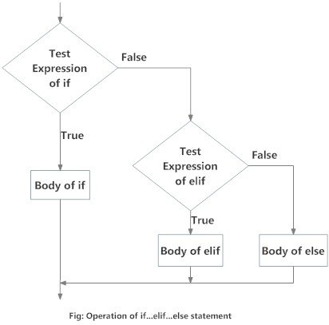

# W1 - Week 1

## Programming Terminologies

[Here](res/Programming%20Terminologies.pdf) is a list of commonly used programming terminologies.

## First Program

```py
print("Hello, World!")
```

## Keywords

Keywords are the _reserved (محجوز)_ words in Python.

We cannot use a keyword as a variable name, function name or any other [identifiers](#identifiers). They are used to define the syntax and structure of the Python language.

In Python, keywords are case-sensitive.

So far, we have covered the following keywords.

<table>
    <tr>
        <td>False</td>
        <td>None</td>
        <td>True</td>
    </tr>
    <tr>
        <td>and</td>
        <td>break</td>
        <td>continue</td>
    </tr>
    <tr>
        <td>elif</td>
        <td>else</td>
        <td>for</td>
    </tr>
    <tr>
        <td>if</td>
        <td>in</td>
        <td>not</td>
    </tr>
    <tr>
        <td>or</td>
        <td>while</td>
        <td>pass</td>
    </tr>
</table>

## Identifiers

An identifier is a name given to _entities (جهات)_ like `class`, `functions`, `variables`, etc. It helps to differentiate one entity from another.

**Note:** Ignore `class` and `functions` for now.

### Rules for writing indentifiers

- Identifiers can be a combination of letters in lowercase (a to z) or uppercase (A to Z) or digits (0 to 9) or an underscore \_.

- An identifier cannot start with a digit.

- Keywords cannot be used as identifiers.

- We cannot use special symbols like !, @, #, $, % etc. in our identifier.

```py
# Some valid identifiers.
x = 3
name = "Mansoor Ahmed"
first_name = "Mansoor"
num1 = 3
num_2 = 5
_password = "2343@adfa"

# Some invalid identifiers.
1num = 323
num@home = "234324"
my name = "Mansoor Ahmed"
```

### Comments

Comments are programmer-readable explanations or _annotations (شروح)_. They are not intended for the python interpreter.

```py
#  A single-line comment.

'''
A multi-line comment.
It can extend up to multiple lines.
'''
```

### Statements

Instructions that a Python interpreter can execute are called statements. In Python, the end of a statement is marked by a newline character.

```py
a = 10 # An assignment statement.

a += 1 # An add and assign statement.

print('Hello, World') # A print statement.
```

**Note:** Multi-line statements are not be discussed for now.

### Expressions

Expressions are evaluated to some final value.

#### Types of expressions

1. Arithemetic Expressions

   Arithmetic expressions use arithmetic operators.

   ```py
   a = 10 + 4               # 14
   b = 42 - 23              # 19
   c = 2 * 4                # 8
   d = 2 / 4                # 0.5
   e = 23 % 5               # 3
   f = 23 // 5              # 4
   g = 4 ** 2               # 16
   h = 4 ** 0.5             # 2
   i = 3 + 5 * 2 / 3        # 6.333333333333334
   j = 3 + ((5 * 2) / 3)    # 6.333333333333334
   ```

   ##### Precedence

   `**` **>** `*` `/` `%` `//` **>** `+` `-`

   **Note:** Expressions `i` and `j` are equivalent.

2. Boolean Expressions

   Boolean expressions use relational operators. Simple boolean expressions can be combined to form complex boolean expressions using logical operators.

   ```py
   a = True                 # True
   b = False                # False
   c = 3 > 10               # False
   d = 3 < 10               # True

   x = 5
   e = 0 < x < 10           # True
   f = 0 < x and x < 10     # True
   ```

   ##### Precedence

   `not` **>** `and` **>** `or`

   **Note:** Expressions `e` and `f` are equivalent.

### Blocks

Python relies on indentation (whitespace at the beginning of a line) to define scope in the code.

```py
# conditional block
a = 10
if a % 2 == 0: # colon is part of the syntax.
    print('a is even!')
else:
    print('a is odd!')

# loop block
i = 0
while i < 10: # colon is part of the syntax.
    print(i)
    i += 1
```

**Note:** The most commonly used size for indentation is `2` or `4` spaces.

### Datatypes

1. `int` - Integer
2. `float` - Float
3. `str` - String
4. `bool` - Boolean
5. `list` - List
6. `tuple` - Tuple

### Some built-in functions

1. `print`

   To print a message on the standard output.

   ```py
   print('Hello, World')        # Hello, World
   print('3 + 4 =', 3 + 4)      # 3 + 4 = 7
   ```

2. `len`

   To find the length of container datatypes.

   ```py
   len('hello')                     # 5
   len([1, 2, 3, 5])                # 4
   len(('Mansoor', 'Ahmed', 19))    # 3
   ```

3. `type`

   To find the datatype of the given argument.

   ```py
   type(3)          # int
   type('hello')    # str
   type(True)       # bool
   type(3.0)        # float
   ```

4. `input`

   To take input from the user through standard input.

   ```py
   name = input('Enter your name: ')
   print(name)
   ```

   **Output:**

   ```
   Enter your name: Mansoor Ahmed
   Mansoor Ahmed
   ```

   **Note:** `input` always returns an `str` object. The input must be manually converted to the desired datatype.

### Conditionals

The `if...elif...else` structure is used to conditionally execute a block of code.



#### Syntax

```py
if some_condition:
    # code in `if` block
    ...
elif some_other_condition:
    # code in `elif` block
    ...
else:
    # code in `else` block
    ...
```

#### Example

```py
num = 23

if num > 0:
    print('The number is positive!')
elif num < 0:
    print('The number is negative!')
else:
    print('The number is zero!')
```

**Note:** Nested conditionals are not discussed for now.

### Loops

1. **While**

   The while loop in Python is used to iterate over a block of code as long as the test expression `some_condition` evaluates to `True`.

   

   #### Syntax

   ```py
   while some_condition:
        # body of `while` loop
        ...
   ```

   **Note:** The value of `some_condition` must change in the body of the `while` loop. Otherwise, it will result in an infinite loop.

   #### Example

   ```py
   i = 0
   while i < 0:
        print(i)
        i += 1
   ```

   **Output:**

   ```
   0
   1
   2
   3
   4
   5
   6
   7
   8
   9
   ```

2. **For**

   The `for` loop in Python is used to iterate over a sequence (`list`, `tuple`, `string`) or other iterable objects. Iterating over a sequence is called traversal.

   #### Syntax

   ```py
   for variable_name in sequence_container:
        # use `variable_name`
        ...
   ```

   #### Examples

   1. With `range`

   ```py
   for i in range(5, 10):
        print(i)

   # or

   r = range(5, 10)
   for i in r:
        print(i)
   ```

   **Output:**

   ```
   5
   6
   7
   8
   9
   ```

   2. With `list`

   ```py
   lst = [1, 6, 7, 3, 6, 3]
   for item in lst:
      print(item)

   # or

   for item in [1, 6, 7, 3, 6, 3]:
       print(item)
   ```

   **Output:**

   ```
   1
   6
   7
   3
   6
   3
   ```

   **Note:** `for` can also be used with `tuple` in a similar way.

   3. With `str`

   ```py
   for c in 'hello':
      print(s)

   # or

   s = 'hello'
   for c in s:
      print(s)
   ```

   **Output:**

   ```
   h
   e
   l
   l
   o
   ```

### References

- https://www.programiz.com/python-programming
- https://www.w3schools.com/python/
