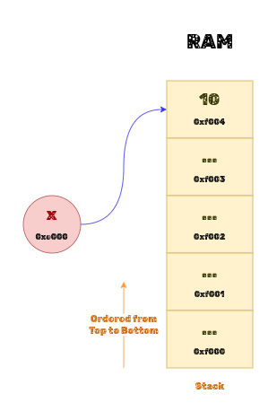
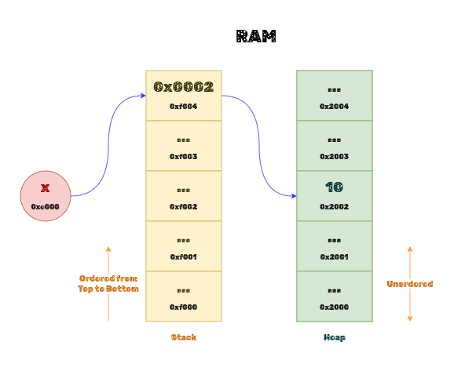

# W2 - Week 2

## Data Types in Python

### Language Design - Statically vs. Dynamically Typed Languages

#### Statically Typed Languages

- In statically-typed languages, variable types are known at compile time.
- It implies that the language does not allow you to change the type of a variable at run-time.
- All variables in a statically-typed language have a type associated with them.
- Variables may or may not be pointers (or references) to data in memory.

#### Dynamically Typed Languages

- A dynamically-typed language performs type checking at runtime.
- Variables are pointers (or references) to real objects in memory.

### Illustration

<p align="center">
   <br>
   <small><b><small>F.2.1.</small> Static Allocation</b></small>
</p>

<br>

<p align="center">
   <br>
   <small><b><small>F.2.2.</small> Dynamic Allocation</b></small>
</p>

**Note:** Stack and Heap are regions of Random Access Memory (RAM). They will not been discussed in detail for now.

### Python - A Dynamically Typed Language

- Python is a dynamically typed language.

- Everything is an `object`, meaning all data types are instances of the `object` class.

### Classifying Data

There are different ways to classify data.

#### Classification based on the type of data

1. <u>**Numeric Data**</u>

   Numeric is anything of, relating to, or containing numbers.

   - **Integer Data**

      _Datatype:_ - In python, `int` is used to represent integer data.

   - **Floating-Point Data**

      _Datatype:_ In python, `float` is used to represent floating-point data.

   - **Complex Data**

      _Datatype:_ In python, `complex` is used to represent complex data.

2. <u>**Textual Data**</u>

   It consists of letters, numbers, symbols, special characters, and whitespaces.

   __Example:__ `"Hello"`, `'I am 5 years old.'`, `'Hello\n'`, `"All the best 🙂"`, `"سوال"`, etc.

   __Datatype:__ In python, `str` is used to represent textual data.

   <u>**Additional Information:**</u>

      All statically-typed languages have a `char` datatype to represent single-character data. These languages use single quotes to represent `char` and double quotes to represent (their equivalent for) `str`.

      Python doesn't have a specific datatype for storing single-character data. This implies that Python does not distinguish between single-character and multi-character data.

     - **Single-Character Data** _(Not supported by Python)_

         __Example:__ `'$'`, `'A'`, `'5'`, `'\n'`, `'🙂'`, `'𞸎'`, etc.

         Given below is a sample code for the Java programming language.

         ```java
         char c = 'D';        // Notice the single quotes.
         String str = "D";    // Notice the double quotes.
         ```

3. <u>**Boolean Data**</u>

   Boolean data has two possible states:

   - `True`
   - `False`

   __Datatype:__ In python, `str` is used to represent textual data.

4. <u>**No Data**</u>

   No data means absence of data.

#### Classification based on the quantity of data

1. A single unit of data
2. A sequence of data (Container)

(Work in progress)
